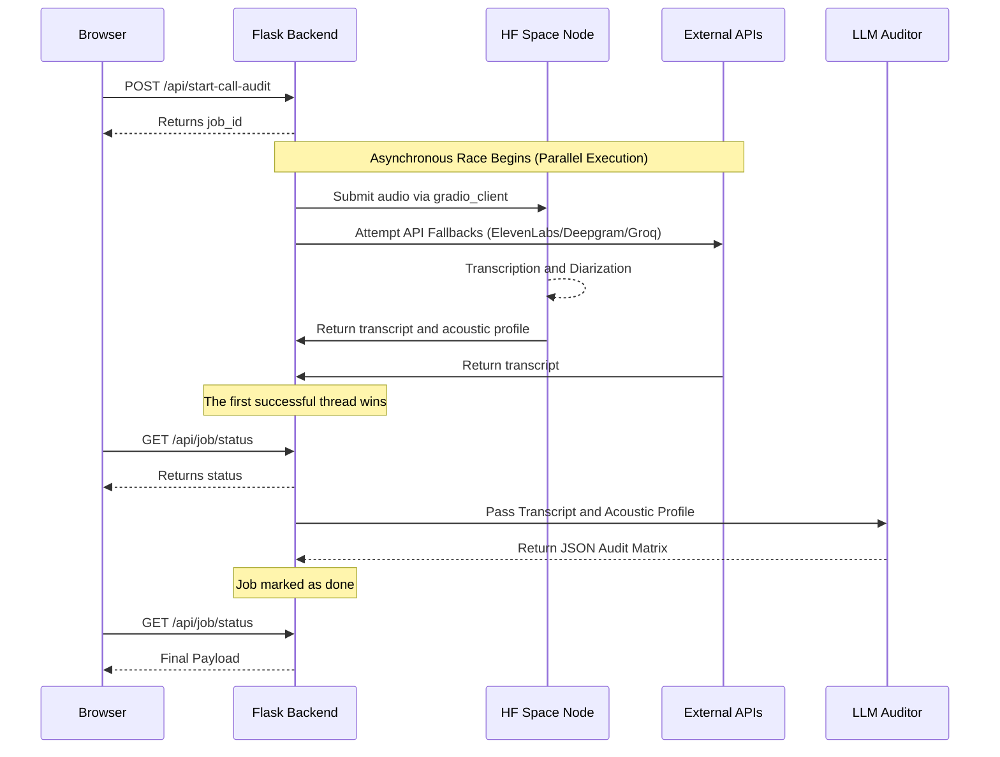

<div align="center">
  
  <h1>Qualora</h1>
  <p><strong>Turn every conversation into intelligence.</strong></p>
  <p><em>An enterprise-grade, distributed AI platform for customer support auditing, employing a hybrid competitive architecture for voice-to-insights processing.</em></p>

  [](#)
  [](#)
  [](#)
  [](#)
</div>

---

## 📋 Table of Contents

1. [Project Overview](#-project-overview)
2. [Key Capabilities](#-key-capabilities)
3. [System Architecture](#-system-architecture)
4. [Technology Stack](#-technology-stack)
5. [Getting Started](#-getting-started)
6. [Hugging Face Space Node Setup](#-hugging-face-space-node-setup)
7. [API Reference](#-api-reference)
8. [The LLM-as-a-Judge Audit Matrix](#-the-llm-as-a-judge-audit-matrix)
9. [Troubleshooting](#-troubleshooting)
10. [Roadmap](#-roadmap)

---

## 🌟 Project Overview

**Qualora** (formerly known as Briefly) is a cutting-edge AI quality auditing platform designed to process, diarize, and analyze omnichannel customer support interactions. It ingests audio or text, performs deep acoustic profiling (pitch, intensity, emotion), transcribes via competitive asynchronous execution, and utilizes an **LLM-as-a-Judge** framework to score agents on empathy, bias, resolution efficiency, and compliance.

Built for robustness, Qualora utilizes a **Distributed Hybrid Architecture**. Requests race across parallel compute nodes: a free, heavy-duty Hugging Face Space (performing ECAPA-TDNN acoustic diarization and prosody analysis) vs. a high-speed API fallback chain (ElevenLabs → Deepgram → Groq). The fastest valid response wins, guaranteeing **100% uptime and minimal latency**.

---

## ✨ Key Capabilities

1. 🎙️ **Multi-Speaker Recognition & Profiling**  
   Pyannote 3.1 combined with SpeechBrain extracts voiceprints, detects elevated acoustic stress (pitch/intensity via Parselmouth), and classifies physiological emotion directly from the audio envelope.
   
2. 🤖 **Competitive Asynchronous Engine**  
   Simultaneous execution across free-tier compute (HF Space) and premium APIs. Graceful degradation and zero single-point-of-failure.  

3. ⚖️ **LLM-as-a-Judge Auditing**  
   Evaluates conversations using Llama-3.3-70b to output a structured JSON matrix. Includes an Agent F1 Score, Emotional Timeline, HitL (Human-in-the-Loop) routing flags, and psychologically grounded behavioral nudges.

4. 📊 **Seamless UI & History Archive**  
   Vanilla JS frontend with an elegant, responsive design. Features real-time job polling, audio playback, and local history archiving.

---

## 🏛️ System Architecture

Qualora leverages a master-worker pattern. The Flask application acts as the master node, orchestrating long-running transcription tasks through an asynchronous job queue. 

### The Distributed Hybrid "Race"

When a file is uploaded, an async job is generated inside the Flask backend. 
- **Thread A (The HF Node):** The file is streamed to a private Hugging Face Space running `faster-whisper`, `pyannote`, and `speechbrain`.
- **Thread B (The API Chain):** The file is sent through a waterfall sequence: ElevenLabs Scribe → Deepgram Nova-2 → Groq Whisper.

The first thread to successfully return a full transcript resolves the job. Once resolved, the **LLM Auditor** kicks in, injecting acoustic context directly into the prompt to ground textual evaluation in biometric reality.

### Workflow Sequence Diagram



---

## 🛠️ Technology Stack

| Layer | Technologies |
|---|---|
| **Frontend** | Vanilla HTML5, CSS3, JavaScript (ES6+), Fetch API |
| **Backend** | Python 3.10+, Flask, Threading, Gradio Client |
| **ASR (On-Premise/HF Node)** | `faster-whisper` (int8), `pyannote/speaker-diarization-3.1` |
| **Acoustic Analytics** | `speechbrain` (wav2vec2 emotion), `parselmouth` (Praat pitch/intensity) |
| **External APIs** | ElevenLabs (Scribe), Deepgram (Nova-2), Groq (Whisper + Llama 3) |

---

## 🚀 Getting Started

### Prerequisites
- Python 3.10 or higher
- Git
- Access tokens for required external APIs

### Local Installation

1. **Clone the Repository**
   ```bash
   git clone https://github.com/yourusername/qualora.git
   cd qualora
   ```

2. **Set up a Virtual Environment**
   ```bash
   python -m venv venv
   source venv/bin/activate  # On Windows: venv\Scripts\activate
   ```

3. **Install Dependencies**
   ```bash
   pip install -r requirements.txt
   ```

4. **Environment Variables Configuration**
   
   Create a `.env` file in the root directory:
   ```env
   # LLM Auditor and Whisper Fallback
   GROQ_API_KEY=gsk_your_groq_key_here
   
   # API Transcription Fallbacks (Optional but recommended)
   ELEVENLABS_API_KEY=sk_your_elevenlabs_key_here
   DEEPGRAM_API_KEY=your_deepgram_key_here
   MURF_API_KEY=your_murf_key_here
   
   # Distributed Compute Node (Hugging Face Space)
   HF_TOKEN=hf_your_read_token_here
   HF_SPACE_URL=your_hf_username/briefly-asr-node
   HF_SPACE_TOKEN=hf_your_read_token_here
   ```

5. **Start the Development Server**
   ```bash
   python app.py
   ```
   Navigate to `http://localhost:5000` in your browser.

---

## ☁️ Hugging Face Space Node Setup

The HF Space node provides free, GPU/CPU-backed deep analysis (diarization + acoustic processing). 

1. Create a **Private Space** on Hugging Face using the `Docker` SDK.
2. In the `hf_space/` directory of this repo, push `app.py`, `requirements.txt`, and `Dockerfile` to your Space limit.
3. Configure the following **Repository Secrets** within your HF Space:
   - `HF_TOKEN`: Your HuggingFace Read Token (required to download Pyannote).
   - `WHISPER_MODEL`: e.g., `large-v3` or `medium` (Medium is recommended for faster cold boots on free tiers).
4. **IMPORTANT**: You must visit the [Pyannote 3.1 Model Page](https://huggingface.co/pyannote/speaker-diarization-3.1) and accept their user agreement to allow the pipeline to download the weights.
5. In your local `.env`, set `HF_SPACE_URL` to your space (e.g., `prathamamritkar/genAI-qualityBot`).

---

## 📡 API Reference

### `POST /api/start-call-audit`
Upload an audio file to start a background processing job.
- **Payload**: `multipart/form-data` with `audio` file.
- **Response**:
  ```json
  {
    "job_id": "4a001249feb54efa8fc52bbce23dea4a",
    "fallbacks_available": ["elevenlabs", "deepgram", "groq"],
    "hf_active": true
  }
  ```

### `GET /api/job/<job_id>/status`
Poll the current execution state of a job.
- **Response Structure (In-Progress)**:
  ```json
  {
    "status": "hf_transcribing",
    "source": null,
    "api_chain_started": false,
    "error": null
  }
  ```
- **Response Structure (Done)**:
  ```json
  {
    "status": "done",
    "source": "hf_space",
    "transcript": "Speaker 0: Hello...\n\nSpeaker 1: Hi...",
    "acoustic_profile": { ... },
    "audit": { ... }
  }
  ```

### `POST /api/job/<job_id>/transcribe-now`
Manually kick-offs the API Chain fallback sequence if the user does not want to wait for the HuggingFace space cold-boot.

---

## 🧠 The LLM-as-a-Judge Audit Matrix

Our evaluation prompts force the LLM to output pure JSON mapping the conversation across psychological and compliance vectors:

```json
{
  "summary": "Customer requests immediate refund due to double billing error.",
  "agent_f1_score": 0.92,
  "satisfaction_prediction": "High",
  "compliance_risk": "Green",
  "quality_matrix": {
    "language_proficiency": 10,
    "cognitive_empathy": 8,
    "efficiency": 9,
    "bias_reduction": 10,
    "active_listening": 9
  },
  "emotional_timeline": [
    {"turn": 1, "speaker": "Customer", "emotion": "Frustrated", "intensity": 8},
    {"turn": 2, "speaker": "Agent", "emotion": "Empathetic", "intensity": 6}
  ],
  "hitl_review_required": false,
  "behavioral_nudges": [
    "Mirroring: Next time, repeat the specific billing date back to the customer to validate their frustration sooner."
  ]
}
```
*Note: If acoustic profiling succeeds, physical biometric indicators (e.g., `avg_pitch=280Hz`) are prepended to the LLM's prompt to ground textual emotion inference with real data.*

---

## 🚧 Troubleshooting

- **No Diarization (All tokens assigned to "Speaker 0"):** 
  You are likely falling back to the Groq API because your HF Space crashed and ElevenLabs/Deepgram aren't configured. Groq's API currently does not support speaker diarization. Fill in the `ELEVENLABS_API_KEY` for premium fallback.
  
- **Vercel Serverless Timeouts (`504 Gateway Timeout`):**
  If deployed to Vercel, traditional sync endpoints fail after 10–60s. Use the asynchronous polling flow (`/api/start-call-audit` + `/api/job/<id>/status`) which handles large files dynamically.
  
- **Hugging Face Token Errors (`unexpected keyword argument 'use_auth_token'`):**
  Ensure your HF Space is running the latest `transformers` library where `token=` has replaced `use_auth_token=`. (Already patched in the latest versions).

---

## 🗺️ Roadmap

- **Streaming ASR:** True WebSockets implementation for mid-call auditing.
- **Voice Synthesis:** Voice cloning and read-back for simulated agent training.
- **CRM Integration:** Webhook exports directly into Salesforce or Zendesk instances.
- **Multilingual Models:** Expansion beyond English using SeamlessM4T or Whisper large-v3 language detection.

---

## 📄 License & Acknowledgements

Created for educational, enterprise, and demonstration use. Built with immense gratitude to the open-source ML community:
* [Pyannote Audio](https://github.com/pyannote/pyannote-audio)
* [Faster-Whisper](https://github.com/SYSTRAN/faster-whisper)
* [SpeechBrain](https://speechbrain.github.io/)

**Qualora: Unlocking the human element of your support data.**
